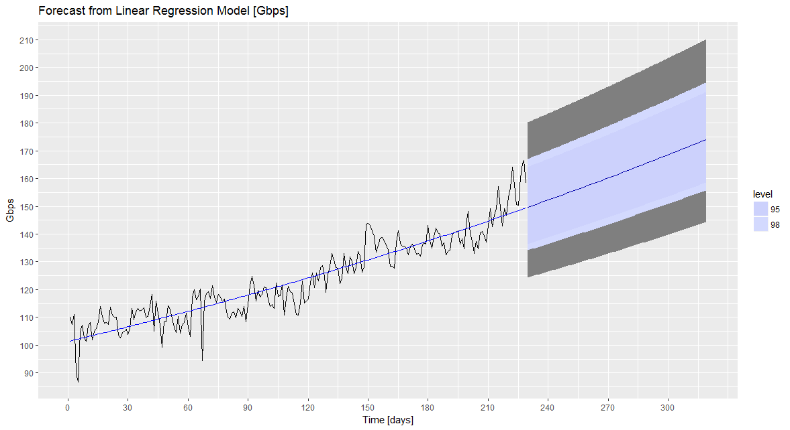
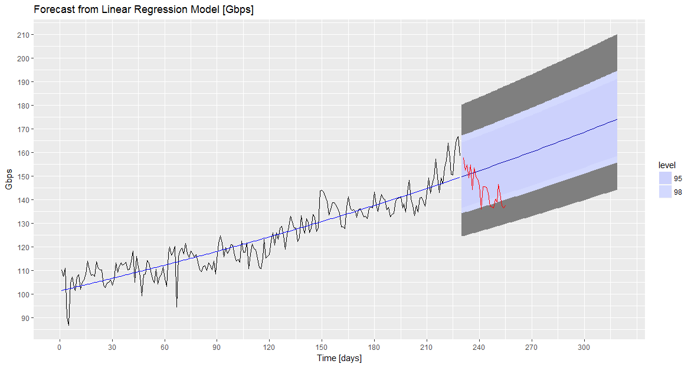

### Summary 
In this project we explore the Mobile Internet speed growth, anlyzing 8 months data real Mobile Network Operator. We provide a 3 months forecast and compare with actual measures.

### The Model
As the available data is from a large Mobile Network Operator, we expect that the data rate growth follows the edhilm's law, more precisely that the log of data rate against time is linear. See for example [this document.](http://www.ece.northwestern.edu/~mh/MSIT/edholm.pdf)

### The Forecast
Based on the available data, the obtain forecast is as follows, Note the exponential growth of the data rate.The gray area in te forecast region is 99.99%.

### Validation - a problem about Data Veracity
In order to validate the forecast, we plot -red lines- 30 days of actual data rate values, recorded after we performed the forecast.

Note that the measures (red lines) are falling in the gray area that is a very unlikely area according to the model (less then 2%). So from the results we are very skeptical about the new - red data. And in fact it turned out that the system that was measuring the data rate, had problems in the last couple of weeks, so that the new - red data is not realiable.

This shows that a robust model can help to identify anomalies in the veracity of the available data.